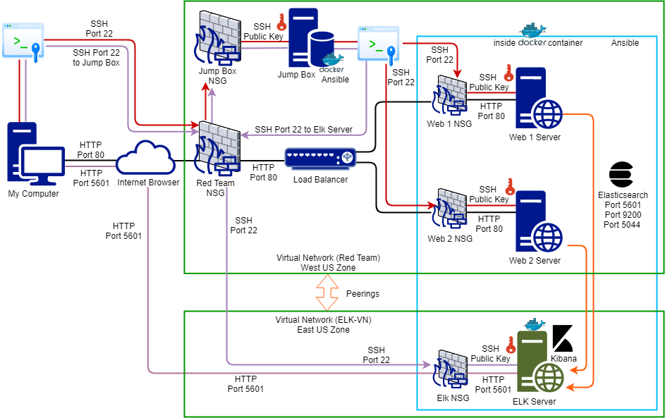
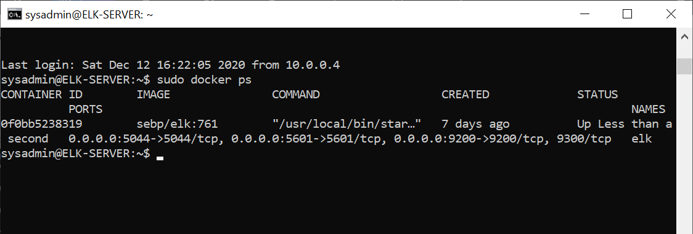

## Automated ELK Stack Deployment

The files in this repository were used to configure the network depicted below.

These files have been tested and used to generate a live ELK deployment on Azure. They can be used to either recreate the entire deployment pictured above. Alternatively, select portions of the yml files may be used to install only certain pieces of it, such as Filebeat.

- elk.yml
- filebeat-plybook.yml
- metricbeat-playbook.yml

This document contains the following details:
- Description of the Topology
- Access Policies
- ELK Configuration
  - Beats in Use
  - Machines Being Monitored
- How to Use the Ansible Build

### Description of the Topology

The main purpose of this network is to expose a load-balanced and monitored instance of DVWA, the D*mn Vulnerable Web Application.

Load balancing ensures that the application will be highly availability, in addition to restricting denial-of-service (DoS) attack to the network.  A load balancer adds additional layer of security to a website. Load balancers can reduce the load on web servers and optimize traffic for a better user experience (Rhine, 2019).  Moreover, load balancers can defends web servers against denial-of-service attacks. 

The advantage of a jump box is that it adds a layer of security by not letting admins or clients directly connect to the servers.  Any user on the network can access and potentially attack any server in the network.  But, when Jump Box is employed, controls can be put in place by allowing only the whitelisted IP addresses to connect to the servers through Jump Box (Erat, 2016).

Integrating an ELK server allows users to easily monitor the vulnerable VMs for changes to the network traffic and system CPU, memory, and load.
- Filebeat monitors log files for real-time incident response, as well as collects log events, and forwards them either to Elasticsearch or Logstash.
- Metricbeat monitors and analyzes system CPU, memmory and load.

The configuration details of each machine may be found below.

| Name          | Function   			       | IP Address          | Operating System |
|---------------|--------------------------------------|---------------------|------------------|
| Jump Box      | Gateway to the servers               | 10.0.0.4            | Linux            |
| Web 1 Server  | Process & deliver web pages          | 10.0.0.5            | Linux            |
| Web 2 Server  | Process & deliver web pages          | 10.0.0.6            | Linux            |
| ELK Server    | Log data & monitor network traffic   | 10.1.0.4            | Linux            |
| Load Balancer | Distribute network traffic           | 104.42.75.65        | Linux            |
| My Computer   | Access other machines as an end user | 192.168.2.1         | Windows          |

### Access Policies

The machines on the internal network are not exposed to the public Internet. 

Only the load balancer machine can accept connections from the Internet. In this deployment, access to the load balancer is allowed from My Computer with an IP address of 192.168.2.1.

Machines within the network can only be accessed by SSH with authenticated SSH keys.  And, in this current setting, the SSH access to ELK Server is allowed only from Jump Box which has an IP address of 10.0.0.4.

A summary of the access policies in place can be found in the table below.

| Name         | Publicly Accessible| Allowed IP Addresses|  
|--------------|--------------------|---------------------|
| Jump Box     | No                 | 198.168.2.1:22|
| Web 1 Server | No                 | 10.0.0.4:22, 104.42.75.65:80, (192.168.2.1:80 for testing purpose)|    	
| Web 2 Server | No                 | 10.0.0.4:22, 104.42.75.65:80, (192.168.2.1:80 for testing purpose)|   	
| Load Balancer| Yes		    | 192.168.2.1:80|
| ELK Server   | Yes                | 10.0.0.4:22, 192.168.2.1:5601, 10.0.0.5:9200 (Elasticsearch), 10.0.0.5:5601 (Kibana), 10.0.0.6:9200 (Elasticsearch), 10.0.0.6:5601 (Kibana)|

### Elk Configuration

Ansible was used to automate configuration of the ELK machine. No configuration was performed manually, which is advantageous because Ansible can significantly reduce maintenance overheads and performance degradation. Ansible is simple to learn with easily understandable Python language (Dharmalingam, 2019).

The playbook implements the following tasks:
- Install docker on on Ubuntu
- Install package installer for Python3
- Install docker python module with pip
- Increase max_map_count parameter to result an error when starting Elasticsearch
- Download and launch a docker container for ELK Server

The following screenshot displays the result of running `docker ps` after successfully configuring the ELK instance.

### Target Machines & Beats
This ELK server is configured to monitor the following machines:
- 10.0.0.5
- 10.0.0.6

We have installed the following Beats on these machines:
- Filebeat
- Metricbeat

These Beats allow us to collect the following information from each machine:
- Filebeat collects log events and any logs that are stored in the /var/log directory of the related web servers, for example syslog data.  
- Metricbeat collects system metrics and statistics, such as CPU and memory usage, network traffic, and load statistics.

### Using the Playbook
In order to use the playbook, you will need to have an Ansible control node already configured. Assuming you have such a control node provisioned: 

SSH into the control node and follow the steps below:
- Copy the following files to the /etc/ansible directory.
  - [filebeat-playbook.yml](https://github.com/abudhaka/Elk-Stack-Project/blob/main/Ansible/filebeat-playbook.yml)
  - [filebeat-config.yml](https://github.com/abudhaka/Elk-Stack-Project/blob/main/Ansible/filebeat-config.yml)
  - [metricbeat-playbook.yml](https://github.com/abudhaka/Elk-Stack-Project/blob/main/Ansible/metricbeat-playbook.yml)
  - [metricbeat-config.yml](https://github.com/abudhaka/Elk-Stack-Project/blob/main/Ansible/metricbeat-config.yml)

- Update the default ansible [hosts](https://github.com/abudhaka/Elk-Stack-Project/blob/main/Ansible/hosts.yml) file to include 10.1.0.4 IP address. This hosts file specifies to the ansible playbook to install and configure ELK Server on 10.1.0.4 IP address and install Filebeat and Metricbeat on 10.0.0.5 and 10.0.0.6 IP addresses of the two web servers.

- Run the playbook, and navigate to the Kibana application on the ELK server GUI website (http://[ELK public IP address]:5601/app/kibana) to check that the installation worked as expected.  In this deployment, The ELK public IP address of 104.211.28.24 is used to connect to the Filebeat and Metricbeat applications.  SSH barrage, Linux stress, and wget-DoS tests were conducted to verify that Kibana picks up the data and monitors the network traffic, load, CPU usage and memory usage on the ELK server.

The specific commands you will need to run to download the playbook, update the files, etc.
- sudo docker container list --all
- sudo docker start (name of the docker container)
- sudo docker attach (name of the docker container)
- cd /etc/ansible
- ansible-playbook elk.yml
- ansible-playbook filebeat-playbook.yml
- ansible-playbook metricbeat-playbook.yml

### References

Dharmalingam, N. (2019, November 5). _Advantages and Disadvantages of Ansible_ https://www.whizlabs.com/blog/ansible-advantages-and-disadvantages/

Rhine, J. (2019, April 25). _What a load balancer does?_ https://lumecloud.com/what-does-a-load-balancer-do/

Erat, J. (2016, July 23). _Jump Servers for security_ https://security.stackexchange.com/questions/130707/jump-servers-for-security

